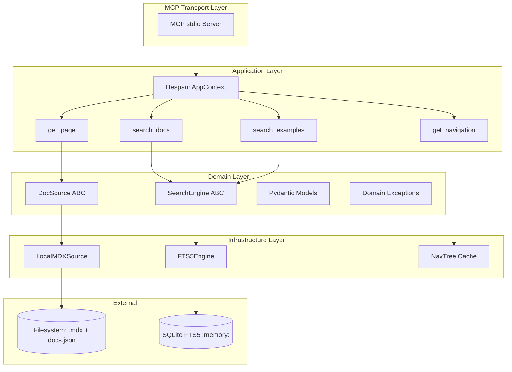

# Architecture Reference

The internal architecture of agno-docs-mcp — ports, adapters, and data flow.

## High-Level Design



## Ports (Abstract Base Classes)

### `DocSource`

```python
class DocSource(ABC):
    """Abstract source for documentation pages."""

    @abstractmethod
    async def get_page(self, path: str) -> DocPage: ...
    @abstractmethod
    async def list_pages(self) -> list[str]: ...
    @abstractmethod
    async def get_nav_tree(self) -> NavTree: ...
```

**Responsibility**: Read documentation pages and navigation structure.

**Current adapter**: `LocalMDXSource` — reads `.mdx` files and `docs.json` from the local filesystem.

**Future adapters**: `RemoteDocSource` (fetch from HTTP), `GitDocSource` (clone + read), `S3DocSource` (cloud storage).

### `SearchEngine`

```python
class SearchEngine(ABC):
    """Abstract search backend."""

    @abstractmethod
    async def index(self, pages: list[DocPage]) -> None: ...
    @abstractmethod
    async def search(self, query: str, topic: str | None, limit: int) -> list[DocHit]: ...
    @abstractmethod
    async def search_examples(self, query: str, limit: int) -> list[DocHit]: ...
```

**Responsibility**: Index content and execute full-text search queries.

**Current adapter**: `FTS5Engine` — SQLite FTS5 with BM25 ranking and Porter stemming.

**Future adapters**: `VectorSearchEngine` (embeddings), `MeilisearchEngine`, `TypesenseEngine`.

## Adapters

### `LocalMDXSource`

```python
class LocalMDXSource(DocSource):
    def __init__(self, docs_path: str): ...
```

- Reads all `.mdx` files recursively from `docs_path`
- Parses YAML frontmatter via `pyyaml`
- Loads `docs.json` for the navigation tree
- All blocking I/O wrapped in `asyncio.to_thread`

### `FTS5Engine`

```python
class FTS5Engine(SearchEngine):
    def __init__(self, tokenizer: str = "porter"): ...
```

- Creates in-memory SQLite database on index
- FTS5 virtual table with `porter` tokenizer
- Custom BM25 ranking implementation
- Snippet generation with `<b>` highlighting
- Over-fetching for `search_examples` (4× limit)

## Dependency Injection

`AppContext` is the wiring point — it holds references to the adapters:

```python
class AppContext:
    doc_source: DocSource      # Injected at startup
    search_engine: SearchEngine # Injected at startup
    nav_tree: NavTree | None   # Cached after first parse
```

**Startup flow**:

```
1. Parse CLI args / env var → get AGNO_DOCS_PATH
2. Create LocalMDXSource(AGNO_DOCS_PATH)
3. Create FTS5Engine(tokenizer="porter")
4. Load all pages from DocSource → index into SearchEngine
5. Parse docs.json → cache NavTree
6. Create AppContext with wired dependencies
7. Start MCP server with AppContext as lifespan context
```

**Why dependency injection?** Tools never import SQLite or filesystem directly. They only interact with `DocSource` and `SearchEngine` abstractions. This makes testing trivial (inject mocks) and future adapter swaps zero-change for tool logic.

## Async Strategy

All blocking operations run in `asyncio.to_thread`:

```python
# Disk reads
async def get_page(self, path: str) -> DocPage:
    return await asyncio.to_thread(self._read_page_sync, path)

# SQLite operations
async def search(self, query: str, topic: str | None, limit: int) -> list[DocHit]:
    return await asyncio.to_thread(self._search_sync, query, topic, limit)
```

This keeps the MCP stdio event loop free during I/O.

## Project File Layout

```
src/mcp_agno_docs/
├── __init__.py          # Package marker
├── __main__.py          # CLI entry point (python -m mcp_agno_docs)
├── server.py            # FastMCP server + lifespan + AppContext
├── models.py            # Pydantic v2 schemas (12 models)
├── errors.py            # Domain exceptions (5 classes)
├── utils.py             # Shared utilities
│
├── sources/             # DocSource port + adapters
│   ├── base.py          # DocSource ABC
│   └── local_mdx.py     # LocalMDXSource adapter
│
├── search/              # SearchEngine port + adapters
│   ├── base.py          # SearchEngine ABC
│   └── fts5.py          # FTS5Engine adapter
│
├── tools/               # MCP tool handlers
│   ├── search.py        # search_docs + search_examples
│   ├── pages.py         # get_page
│   └── navigation.py   # get_navigation
│
└── indexer/             # Navigation parser
    └── navigation.py    # docs.json → NavTree
```

## Testing Architecture

```
tests/
├── unit/                # Pure logic, mocked dependencies
│   ├── test_models.py
│   ├── test_errors.py
│   ├── test_fts5.py    # FTS5 with in-memory sqlite
│   ├── test_local_mdx.py
│   ├── test_search.py
│   └── test_nav.py
│
├── integration/         # Real SQLite + real filesystem
│   ├── test_server.py
│   ├── test_tools.py
│   └── test_fts5_full.py
│
├── e2e/                 # MCP protocol via stdio
│   └── test_mcp_client.py
│
└── fixtures/docs/       # Synthetic test data
    ├── docs.json        # Minimal nav tree
    └── *.mdx            # 9 synthetic pages with frontmatter
```
